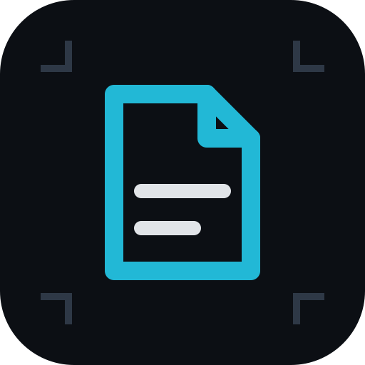

<div align="center">



# Quire

**A PDF workshop that runs on your device.**

25 tools that merge, split, sign, redact, compress, convert and inspect PDFs —
all of them inside your browser. No uploads, no accounts, no server.

[**Open the app →**](https://mrhakan.github.io/pdf-editor/)

</div>

---

## Why

Most PDF tools on the web ask you to upload a contract, a passport scan or a
payslip to a machine you know nothing about, then offer a sentence about
deletion in return. Browsers have been able to do this work locally for years.

Quire is a folder of static files. There is no backend behind it, so there is no
endpoint that could receive a document even if the code tried to send one. Files
you open are read into memory by the tab, worked on, and handed back to your
browser's download machinery.

The home page proves it rather than claiming it: before any other code runs,
Quire wraps `fetch`, `XMLHttpRequest`, `navigator.sendBeacon` and `WebSocket`
with counters, and shows the running total of bytes sent and off-site requests.
Both stay at zero. Your browser's network panel will agree.

## The tools

**Organize** — Merge · Split · Organize pages · Extract pages · Impose sheets
(2-up, 4-up, 8-up and folded booklets)

**Convert** — Images to PDF · PDF to images · Text and Markdown to PDF · Extract
text · Extract images · Scan with the camera

**Edit** — Edit and annotate · Sign · Watermark · Page numbers · Resize and crop
· Redact · Fill forms

**Optimize** — Compress · Repair and flatten

**Secure** — Protect with a password (AES-256) · Remove a password

**Inspect** — Edit metadata · Compare two versions · Make searchable (OCR)

A few of them are worth calling out:

- **Redaction removes.** Painting a black box over text leaves the text in the
  file. Quire rebuilds every redacted page as an image, so the words underneath
  stop existing.
- **OCR runs here.** Tesseract is compiled to WebAssembly and executes in a
  worker on your machine. Recognised words are written back as an invisible text
  layer, which makes a scan searchable without changing how it looks.
- **Rotated pages behave.** Everything you place is positioned in the page's
  *visual* space and converted before it is written, so a footer on a sideways
  scan lands at the bottom and reads the right way up.
- **Unicode is not an afterthought.** The three built-in PDF families only cover
  Latin-1, so anything with Turkish, Polish, Greek or Cyrillic text switches to
  an embedded Noto face automatically, subset to the glyphs you actually used.
- **Compression is honest.** It measures the saving before writing anything, and
  refuses to hand back a file that came out larger than the original.

## Running it yourself

No build step, no bundler, no dependencies to install. Any static file server
will do:

```sh
git clone https://github.com/MrHakan/pdf-editor.git
cd pdf-editor
npx http-server -p 8080 -c-1        # or: python3 -m http.server 8080
```

Then open `http://localhost:8080`. Opening `index.html` straight off the disk
will not work — ES modules and service workers both require a real origin.

Deployment is `git push`: the workflow in `.github/workflows/pages.yml`
syntax-checks every module and publishes the repository as-is to GitHub Pages.

## How it is built

| Layer | What is there |
| --- | --- |
| Interface | Plain ES modules and CSS. No framework, no build step. |
| Documents | [pdf-lib](https://github.com/cantoo-scribe/pdf-lib) writes and edits, [PDF.js](https://mozilla.github.io/pdf.js/) renders and reads. |
| Text | [fontkit](https://github.com/foliojs/fontkit) subsets embedded fonts, Noto covers the scripts the standard fonts cannot. |
| Recognition | [tesseract.js](https://tesseract.projectnaptha.com/) in a worker, with `tessdata_fast` models. |
| Offline | A service worker caches the shell on install and everything else on first use. |

Every library is vendored in `vendor/` and served from the same origin — there
is no CDN anywhere in the app, which is what lets it keep working with the
network switched off. See [`vendor/README.md`](vendor/README.md) for versions
and the one build step involved.

```
index.html            shell and hash router mount point
sw.js                 offline cache
assets/css/app.css    the whole design system
assets/fonts/         interface fonts, and Noto faces for embedding
src/main.js           router, home page, transfer log
src/core/             pdf-lib and PDF.js loaders, geometry, fonts, files
src/ui/               workbench, field engine, page grid, canvas stage
src/tools/            one module per tool, loaded on demand
vendor/               pdf-lib, PDF.js, fontkit, JSZip, Tesseract
```

Adding a tool means writing one module that exports a `mount` function and
adding an entry to `src/tools/registry.js`. The shared workbench supplies the
file handling, the options panel, progress, errors and delivery; a tool
describes its settings as data and provides a `run` function.

## What is stored on your device

| Key | Holds |
| --- | --- |
| `quire.theme` | Whether you chose the light or dark interface. |
| `quire.lifetime` | A count of pages and jobs, so the meter has something to show. No file names. |
| Cache storage | The app's own files, so it opens offline. |

Documents are never written to storage. Close the tab and they are gone from
memory. Clearing site data removes all three.

## Limits worth knowing

- Everything runs in one tab, so very large documents are bound by the memory
  your browser will give a page. A few hundred megabytes is usually fine.
- Removing a password requires the password. Nothing here opens a document you
  cannot already open.
- Compression works by resampling, because no browser ships decoders for every
  filter a PDF may use. Use the lossless "rewrite only" mode to keep the text
  layer.
- OCR is slow — budget a few seconds per page — and the first run fetches the
  engine and language model from this site.
- Always open a redacted file and check it before sending it on.

## Contributing

Issues and pull requests are welcome. When reporting a document that comes out
wrong, the file itself is usually the clue — please don't attach anything
confidential.

## Licence

[MIT](LICENSE). The vendored libraries keep their own licences, listed in
[`vendor/README.md`](vendor/README.md).
